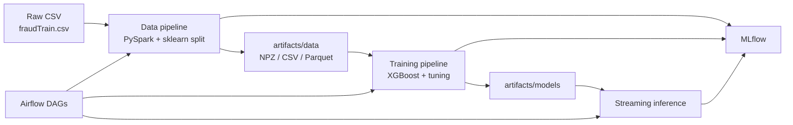

# End-to-End Credit Card Fraud Detection System

A production-oriented machine learning project for detecting fraudulent credit card transactions. It covers data ingestion and PySpark preprocessing, XGBoost training with class-imbalance handling and threshold tuning, batch/streaming inference, experiment tracking with MLflow, and workflow orchestration with Apache Airflow.

## Overview

The system predicts whether a transaction is fraudulent (`is_fraud`) using engineered features such as amount, merchant category, velocity, location mismatch, and binned age/distance/hour fields. Configuration is centralized in `config.yaml`; runnable entry points live under `pipelines/` and `dags/`.

**High-level flow**



## Tech stack

| Area | Tools |
|------|--------|
| Data processing | PySpark, Pandas, NumPy |
| ML | scikit-learn, XGBoost, LightGBM, imbalanced-learn |
| Orchestration | Apache Airflow |
| Experiment tracking | MLflow |
| API (dependencies) | FastAPI, Uvicorn |
| Config | YAML (`config.yaml`) |

The default training path uses **scikit-learn + XGBoost**. `config.yaml` also supports a **PySpark MLlib** training path (`model.framework: pyspark`).

## Project structure

```
├── config.yaml              # Paths, columns, preprocessing, training, MLflow
├── Makefile                 # install, pipelines, MLflow UI, Airflow helpers
├── requirements.txt
├── dags/                    # Airflow DAG definitions
├── pipelines/
│   ├── data_pipeline.py     # End-to-end preprocessing + train/test split
│   ├── train_pipeline.py    # Training, threshold tuning, evaluation
│   └── streaming_inference_pipeline.py
├── src/                     # Ingestion, features, training, evaluation, inference
├── utils/                   # Config, logging, Spark, MLflow, Airflow tasks
├── notebooks/
│   ├── data_pipeline/       # Exploratory / stepwise preprocessing
│   └── model_pipeline/        # EDA, CV, multi-model, tuning, thresholds
├── dataset/raw/             # Place fraudTrain.csv here (not in git)
└── artifacts/               # Generated outputs (gitignored)
```

## Prerequisites

- **Python 3.11** (see `requirements.txt` for pinned-compatible versions)
- **Java 8+** for PySpark
- Sufficient disk space for processed data, models, and MLflow artifacts

## Setup

1. Clone the repository and open a shell at the project root.

2. Create and activate a virtual environment (or conda env), then install dependencies:

   ```bash
   make install
   ```

   Or manually:

   ```bash
   python -m pip install --upgrade pip
   python -m pip install -r requirements.txt \
     --constraint "https://raw.githubusercontent.com/apache/airflow/constraints-2.10.4/constraints-3.11.txt"
   ```

   For Airflow, follow the constraint-file guidance in `requirements.txt` if you hit dependency conflicts.

3. Add training data:

   - Default path: `dataset/raw/fraudTrain.csv` (configured in `config.yaml` → `data_paths.raw_data`).
   - The `dataset/` directory is gitignored; you must supply the CSV locally.

## Configuration

Edit `config.yaml` to change:

- Data and artifact paths (`data_paths`)
- Target column and feature lists (`columns`)
- Missing-value, outlier, binning, encoding, and scaling behavior
- Train/test split (`data_splitting`)
- Model type, hyperparameters, and framework (`model`, `training`)
- MLflow tracking URI and experiment name (`mlflow`)
- Inference defaults (`inference`)

## Running pipelines

From the project root:

| Command | Description |
|---------|-------------|
| `make data-pipeline` | Run PySpark preprocessing; writes `artifacts/data/` |
| `make data-pipeline-rebuild` | Force rebuild (ignore cached NPZ artifacts) |
| `make train-pipeline` | Runs data pipeline if needed, trains XGBoost, tunes threshold, logs to MLflow |
| `make streaming-inference` | Sample single-transaction inference |
| `make run-all` | Data → train → streaming inference in sequence |
| `make clean` | Remove selected artifacts under `artifacts/` and `mlruns/` |
| `make mlflow-ui` | MLflow UI at `http://localhost:5001` (override with `MLFLOW_PORT`) |

Direct Python usage:

```bash
python pipelines/data_pipeline.py          # add --force to rebuild
python pipelines/train_pipeline.py
python pipelines/streaming_inference_pipeline.py
```

### Data pipeline stages (automated)

The `data_pipeline` executes, in order:

1. CSV ingestion  
2. Missing values and feature engineering  
3. Outlier detection (3-sigma) and capping  
4. Feature binning  
5. Encoding (nominal + ordinal)  
6. Standard scaling on selected log features  
7. Stratified train/test split (80/20 by default)  
8. Export to NPZ, CSV, and Parquet under `artifacts/data/`

If processed NPZ files already exist, the pipeline loads them unless `force_rebuild=True`.

### Training pipeline (automated)

The `training_pipeline`:

1. Ensures processed data exists (calls data pipeline)  
2. Loads train/test splits (Parquet by default)  
3. Holds out 15% of train for validation  
4. Applies `RandomUnderSampler` (majority class)  
5. Runs `RandomizedSearchCV` on XGBoost (F1 scoring)  
6. Tunes a decision threshold targeting **precision ≥ 70%** on validation  
7. Evaluates on the test set and saves confusion matrix / metadata under `artifacts/`

Trained model default path: `artifacts/models/xgboost_tuned_model.pkl`.

### Streaming inference

`ModelInference` accepts raw transaction-style fields (see sample payload in `streaming_inference_pipeline.py`), applies the same preprocessing logic as training, and returns prediction labels and probabilities. Threshold metadata is read from the model’s `*_metadata.json` when present.

## Apache Airflow

Airflow home is set to `./airflow` via the Makefile (`AIRFLOW_HOME`).

```bash
make airflow-init          # Initialize DB
make airflow-webserver     # Webserver/UI on port 8080
make airflow-scheduler     # Start scheduler (separate terminal)
make airflow-stop          # Stop Airflow processes
```

DAGs (under `dags/`):

| DAG | Schedule | Tasks |
|-----|----------|--------|
| `data_pipeline_dag` | Every 5 minutes | Validate raw data → run data pipeline |
| `train_pipeline_dag` | Daily (19:30 UTC) | Validate processed data → run training |
| `inference_pipeline_dag` | Every minute | Validate model → run inference |

Ensure `dags/` is on your Airflow `DAGs folder` path (typical when running from this repo with `AIRFLOW_HOME=./airflow`).

## Notebooks (exploratory workflow)

Use notebooks for interactive analysis and to mirror pipeline steps. Run **data pipeline** notebooks in order:

1. `notebooks/data_pipeline/0_handle_missing_values.ipynb`
2. `notebooks/data_pipeline/1_handling_outliers.ipynb`
3. `notebooks/data_pipeline/2_feature_binning.ipynb`
4. `notebooks/data_pipeline/3_handle_encoding.ipynb`
5. `notebooks/data_pipeline/4_handle_scaling.ipynb`
6. `notebooks/data_pipeline/5_handle_imbalance_smote.ipynb`

Run **feature binning before** encoding, scaling, and SMOTENC so downstream steps treat binned fields as categorical.

**Model pipeline** notebooks (typical order):

1. `notebooks/model_pipeline/0_data_preparation.ipynb`
2. `notebooks/model_pipeline/1_base_model_training.ipynb`
3. `notebooks/model_pipeline/2_kfold_validation.ipynb`
4. `notebooks/model_pipeline/3_multi_model_training.ipynb`
5. `notebooks/model_pipeline/4_hyperparam_tuning.ipynb`
6. `notebooks/model_pipeline/5_threshold_optimization.ipynb`

The automated `pipelines/` code path uses undersampling at train time rather than SMOTE in the batch data pipeline; the SMOTE notebook remains useful for experimentation.

## MLflow

Tracking defaults to a local SQLite store (`sqlite:///mlflow.db`) and experiment **Credit Card Fraud Detection**. Pipeline runs log metrics, parameters, and artifacts (processed splits, models, evaluation plots).

```bash
make mlflow-ui
make stop-all    # Stop MLflow UI on MLFLOW_PORT
```

## Logs

Pipeline and Airflow-related logs may appear under `logs/` (gitignored). Application logging is configured via `config.yaml` → `logging`.

## License

This project is licensed under the [GNU General Public License v3.0](LICENSE).
